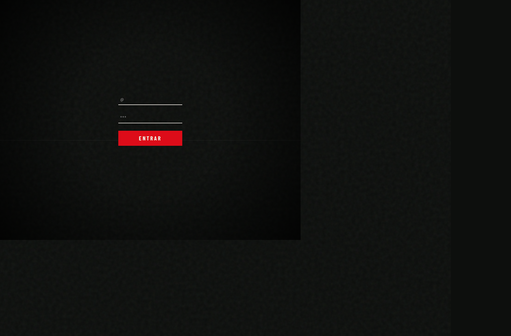

# Streetwear Raffle Platform

> Gated raffle system for streetwear drops — password-protected entry, live prize draws, and a retro CRT aesthetic.



## What it does

- **Gated entry** — users must enter an access code to reach the raffle
- **Raffle registration** — email + Instagram handle, with duplicate detection
- **Admin dashboard** — configure access codes, manage raffles with multiple prize tiers, draw winners live, and keep full history
- **CRT visual effects** — scanlines, noise, vignette, and glitch for a retro streetwear aesthetic

## Tech stack

| Layer | Tech |
|-------|------|
| Backend | [PocketBase](https://pocketbase.io) (single Go binary, SQLite) |
| Frontend | Vanilla JS + Tailwind CSS CDN |
| Fonts | Barlow Condensed 700, Plus Jakarta Sans |
| Build step | **None** |
| Dependencies | **Zero** (no npm, no package.json) |

## Quick start

```bash
# 1. Clone
git clone https://github.com/hibrusi-dev/sorteo.git
cd sorteo

# 2. Run (downloads PocketBase automatically)
chmod +x start.sh
./start.sh
```

The app runs at **http://localhost:8090**.

### First-time setup

1. Open **http://localhost:8090/_/** to create your PocketBase superuser account
2. Go to **http://localhost:8090/admin** and log in with those credentials
3. Set the access code and configure your first raffle

## URLs

| URL | Description |
|-----|-------------|
| `/` | User-facing gate + raffle form |
| `/admin` | Admin dashboard |
| `/_/` | PocketBase native admin UI |

## Project structure

```
├── start.sh              ← Downloads PocketBase & starts server
├── public/
│   ├── index.html        ← User flow: gate → form → confirmation
│   └── admin/
│       └── index.html    ← Admin panel (login + dashboard)
├── pb_migrations/        ← Auto-run database migrations
├── pb_hooks/
│   └── rate_limit.pb.js  ← API rate limiting
└── docs/
    └── screenshot.png
```

## Production deployment

Put a reverse proxy with HTTPS in front of port 8090. Example with Caddy:

```
yourdomain.com {
    reverse_proxy localhost:8090
}
```

## Requirements

- macOS or Linux (amd64 / arm64)
- `curl` and `unzip` installed
- Port `8090` available

## License

MIT
